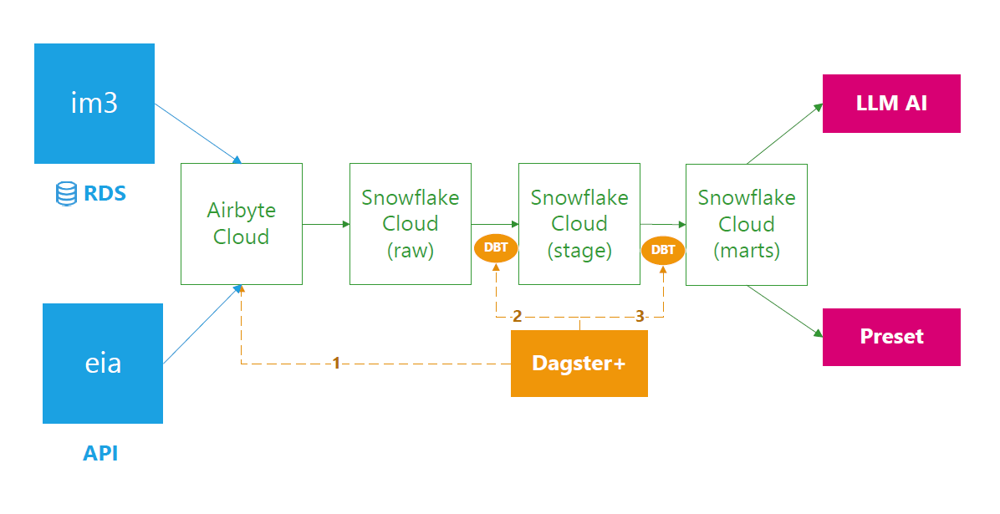
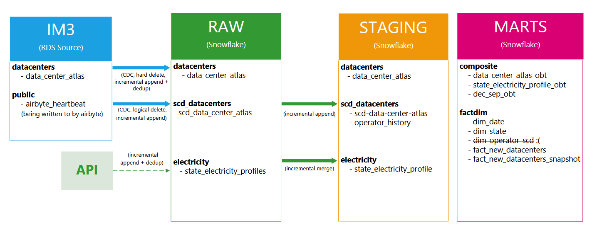
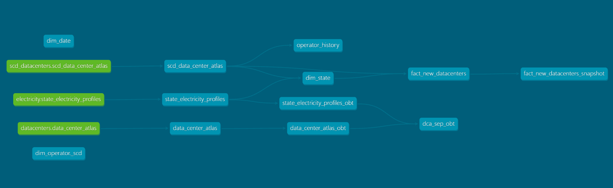
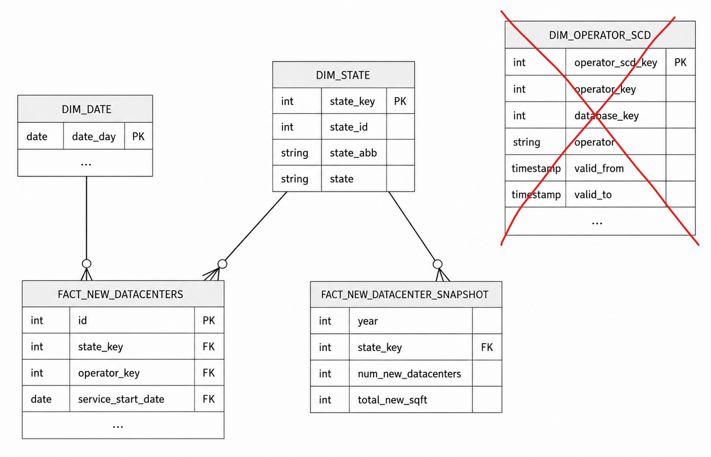
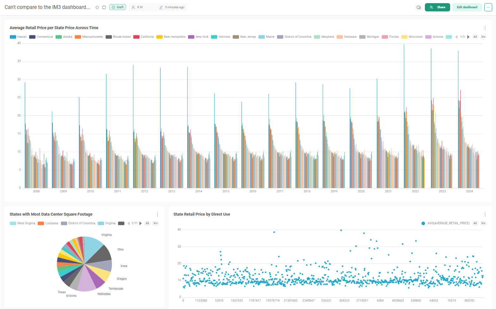

# DEC-Project-2

A Data Engineering Bootcamp project on datacenters and electricity metrics. You can follow step by step below!







### Data Center Atlas (simulated as live data within a database)

IM3 Open Source Data Center Atlas:
- [Data documentation](https://data.msdlive.org/records/p147s-4h760)
- [Data dashboard](https://immm-sfa.github.io/datacenter-atlas/)

1. Set up parameter group for CDC
    - Navigate to RDS, and click on Parameter Groups
    - Create a new parameter group <cdc_parameter_group>, and set rds.logical_replication to 1
2. Set up RDS database
    - Create an AWS account and navigate to RDS
    - It is recommended to set your region to a nearby location when you use AWS services
    - Create Database > Full Configuration
    - Configuration: 
        - Choose a database configuration method: Full Configuration
        - Engine option: PostgreSQL
        - DB Instance Identifier: <rds_db_instance_name> (e.g. 'im3')
        - Credentials Management: manage in AWS Secrets manager
        - Storage > Additional Storage Configuration: deselect 'Enable storage autoscaling'
        - Connectivity > Public access: Yes
        - Additional configuration > DB parameter group: <cdc_parameter_group>
    - Create database...once successfully created, 'View Connection details' to get the database Endpoint url
3. Allow inbound traffic
    - Once the database has been created, go to 'Connectivity and security'
    - Select the default VPC security group
    - Select 'Edit inbound rules'
    - Select 'Add rule'
        - Select "All TCP"
        - Select 'Anywhere-IPv4'
        - Select 'Save rules'
4. Retrieve database connection info
    - Navigate to Secrets Manager and select the newly generated secret
    - Select 'Retrieve secret value' to get the username and password of the database
5. PgAdmin4
    - Install PgAdmin4 
    - Right click on 'Servers' > Register > Server:
        - General > Name: set a <pdadmin_server_name> (e.g. 'aws-rds')
        - Connection > Host name: <endpoint_from_rds>
        - Connection > Port: 5432
        - Connection > Password: <password_from_Secret_Manager>
        - Select "Save"
    - Under the newly created server, right click on 'Databases' > Create > Database, and provide a <database_name> (e.g. 'im3')
    - Right click on the newly created database to select Query Tool
        - Run the SQL within im3_setup.sql
5. Enable CDC
    - For any table we want to replicate with CDC, we need to create a logical replication slot that will track changes
    - In PgAdmin4 run the SQL within `enable_cdc.sql` to enable CDC


### Snowflake

1. 
    - Create Snowflake Account
    - Go to Compute > Warehouse and create a <snowflake_warehouse> (e.g. 'COMPUTE_WH') of desired compute size
    - Select your account at the bottom left, then Account > View Account Details > Account/Server URL to get the <snowflake_host_url>
    - Run the following lines in Snowflake by selecting the plus then Create > SQL File:
        ```sql
        use role accountadmin;
        use warehouse <snowflake_warehouse>;

        create database raw;
        create schema raw.datacenters;
        create schema raw.scd_datacenters;

        create database staging;
        create schema staging.datacenters;
        create schema staging.scd_datacenters;
        create schema staging.electricity;

        create database marts;
        create schema composite;
        create schema factdim;
        ```

### Airbyte 

1. Create an Airbyte cloud account
    - Log into Airbyte ETL
    - We will create a new connection...

2. Create a new airbyte source of type Postgres
    - Name: "RDS-datacenters-1"
    - Host: <endpoint_from_rds>
    - Port: 5432
    - Database Name: <database_name> (e.g. 'im3')
    - Schemas: public
    - Username: postgres
    - Password: <password_from_Secret_Manager>
    - Update Method: Read Changes using Write-Ahead Log (CDC)
    - Replication Slot: 'airbyte_slot_deduped'
    - Publication: 'airbyte_publication'
    - Advanced > Update Method > Optional Fields > Initial Waiting Time in Seconds: 120 
        - (the minimum allowed, otherwise airbyte will continue polling)
    <!-- - Advanced > Update Method > Optional Fields > Debezium Heartbeat Query (advanced): `INSERT INTO airbyte_heartbeat (text) VALUES ('heartbeat')`
        - (refer to [(Advanced) Resolving sync failures due to WAL disk corruption](https://docs.airbyte.com/integrations/sources/postgres/postgres-troubleshooting#advanced-wal-disk-consumption-and-heartbeat-action-query)) -->
    <!-- - Advanced > Update Method > Optional Fields > Invalid CDC position behavior: Re-sync data -->

3. Follow the steps of 2, with these changes (this will connect to the same table, but a different replication slot):
    - Name: "RDS-datacenters-2"
    - Replication Slot: 'airbyte_slot_append'

4. Create a new airbyte destination of type Snowflake
    - Name: "Snowflake-1"
    - Host: <snowflake_host_url>
    - Role: accountadmin
    - Warehouse: <snowflake_warehouse> (e.g. "COMPUTE_WH")
    - Database Name: "raw"
    - Default Schema: "datacenters"
    - Username: <snowflake_login_name>
    - Authorization Method: Username and Password
    - Password: <snowflake_password>
    - Sync Behavior > CDC Deletion Mode: Hard delete

5. Follow the steps of 3, with these changes:
    - Name: "Snowflake-2"
    - Default Schema: "scd_datacenters"
    - Sync Behavior > CDC Deletion Mode: Soft delete

4. Create connections with the newly configured source and destination
    - Connection 1:
        - Source: "RDS-datacenters-1"
        - Destination: "Snowflake-1"
        - Select Sync Mode: Replicate Source
        - Sync Mode: Incremental Append + deduped
        - Connection Name: e.g. "RDS-datacenters-1 → Snowflake"
        - Schedule Type: Manual
        - Destination Namespace > Destination-defined
    - Connection 2 (we will add this so we can model a Slowly Changing Dimension):
        - Source: RDS-datacenters-1
        - Destination: "Snowflake-2"
        - Select Sync Mode: Append Historical Changes
            - Append New Rows and Updates Only
        - Sync Mode: Incremental Append
        - Connection Name: e.g. "RDS-datacenters-2 → Snowflake-2"
        - Schedule Type: Manual
        - Destination Namespace > Destination-defined
        - Stream Prefix: "scd_"


### State Electricity Data (through API)

U.S. Energy Information Administration:
- [API documentation](https://www.eia.gov/opendata/)
- [API dashboard](https://immm-sfa.github.io/datacenter-atlas/)


1. Register for an API key from the links above

2. Create a custom Airbyte source through the Builder > Start from Scratch > Skip and start manually
    - At top left, rename the connector from "Untitled" (e.g. to "eia API")
    - Name the stream (e.g. "state_electricity_profiles")
    - API Endpoint URL: https://api.eia.gov/v2/electricity/state-electricity-profiles/summary/data/?frequency=annual&data[0]=average-retail-price&data[1]=average-retail-price-rank&data[2]=direct-use&data[3]=direct-use-rank&sort[0][column]=period&sort[0][direction]=asc
    - Inputs > Add New User input
        - Input Name: "API Key"
        - Field ID: "api_key"
        - Required Field: enabled
        - Secret Field: enabled
        - Hidden Field: enabled
        - Save changes, then put your actual <api_key> into the input area
    - In the stream, turn on Authenticator
        - Inject API Key Into Outgoing HTTP Request: enable
        - Inject Into: Query Parameter
        - Parameter Name: api_key
    - Add the following Query Parameters as Key/Value string pairs
        - offset : 0
        - length : 5000
    - Turn on Incremental Sync, if desired (for demonstration of custom connector capability; there is not much practical use in this case)
        - Cursor Field: period
        - Cursor Datetime Formats: %Y
        - Start Datetime
            - Datetime: 2008
            - Datetime Format: %Y
        - Turn on Inject Start Time into Outgoing HTTP Request
            - Inject Into: Query Parameter
            - Parameter Name: start
        - Outgoing Datetime Format: %Y
    - Publish as "eia API"
    - Set up new Source, selecting the new connector under Custom
        - Provide the <api_key>

3. Create a new Airbyte connection  
    - In Sources, select the new custom source and enter the <api_key>
    - Choose the Snowflake destination
    - If you enabled Incremental Sync in step 2...
        - Add `period` and `stateID` as primary keys
        - Sync Mode: Incremental | Append + Deduped
        - Schedule Type: Manual
        - Destination Namespace > Custom Format: "electricity"
    - If you did not enable Incremental Sync in step 2...
        - Select Sync Mode: Replicate Source
        - Sync Mode: Full Refresh Overwrite
        - Schedule Type: Manual
        - Destination Namespace > Custom Format: "electricity"


### DBT

1. DBT will need information to connect to Snowflake
    - In Snowflake, elect your username at the bottom left, then Account > View Account Details > Account Identifier to get the <snowflake_account>
    - If you want to run dbt locally, you need to export these as environment variables in terminal:
        ```powershell
        # Example: PowerShell
        $env:SNOWFLAKE_USERNAME="<snowflake_login_name>"
        $env:SNOWFLAKE_PASSWORD="<snowflake_password>"
        $env:SNOWFLAKE_ACCOUNT="<snowflake_account>"
        ```
    - As DBT works it will also run our data quality tests
    - After DBT is done, these are all of our tables:
        ```sql
        -- raw
        select * from raw.datacenters.data_center_atlas;
        select * from raw.scd_datacenters.scd_data_center_atlas;
        select * from raw.electricity.state_electricity_profiles;

        -- staging
        select * from staging.datacenters.data_center_atlas;
        select * from staging.scd_datacenters.scd_data_center_atlas;
        select * from staging.scd_datacenters.operator_history;
        select * from staging.electricity.state_electricity_profiles;

        --marts
        select * from marts.composite.data_center_atlas_obt;
        select * from marts.composite.state_electricity_profiles_obt;
        select * from marts.composite.data_center_atlas_obt;
        select * from marts.factdim.dim_date;
        select * from marts.factdim.dim_state;
        select * from marts.factdim.dim_operator_scd; -- unfinished...unfortunately
        select * from marts.factdim.fact_new_datacenters;
        select * from marts.factdim.fact_new_datacenters_snapshot;
        ```






### Dagster

1. There is a template.env file in the repo that you will need to turn it into a .env file and supply info to
    - Airbyte client info can be found at...
        - Airbyte Cloud > User > Setting > Applications > Create an Application, then after entering a name you can retrieve Client Id and Client Secret
        - Airbyte Cloud > Workspace Settings to get the Workspace ID at the top right
2. Navigate to the dagster folder and run `dagster dev`
    - click on the link that pops up for local host

### Preset

1. If you want to create your own dashboard, you can create a new account with a free trial
2. Log in then go to Settings > Database Creation > +Database > Snowflake 
    -- Fill in remaining info, and get to work~



### LLM AI
1. With Snowflake Cloud you can create a Semantic View with Cortex Analyst, but if you try to deploy an agent you will hit a paywall.


